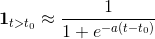
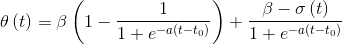
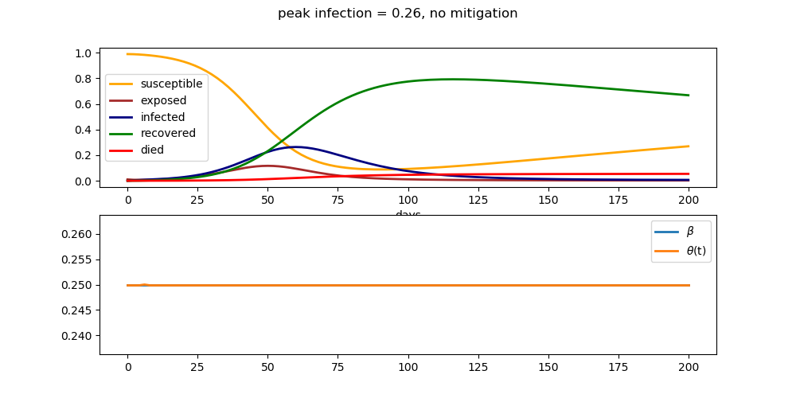
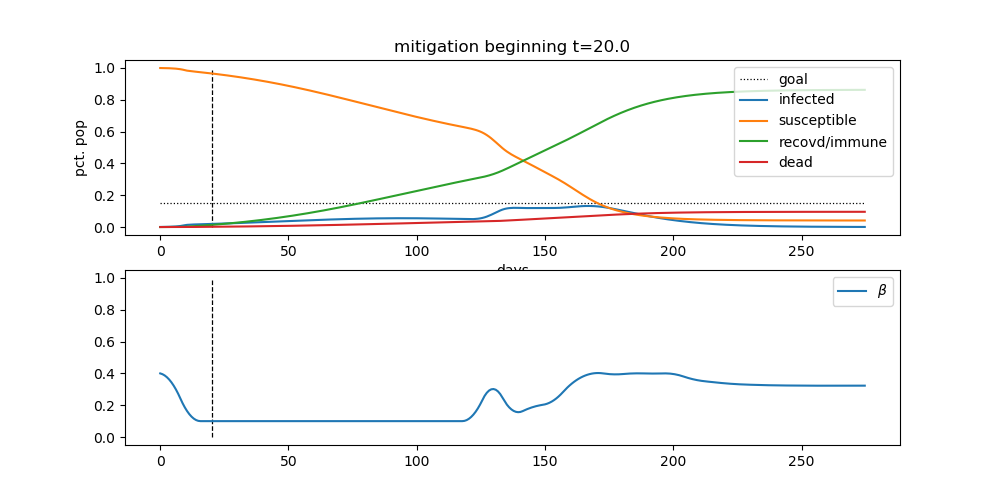

MDAO-Based Pandemic Countermeasure Optimization
========================================================

A Python-based set of tools for pandemic modeling with analytic derivatives, which allows for the numerical optimization of infectious disease mitigation techniques (social distancing, etc.). The aim is to provide a set of tools to help inform or derive localized policy decisions relating to the spread of illnesses such as COVID-19. This will include prognostics of infection magnitude and health care service capacity planning. 

By adapting methods of optimizing large systems of coupled dynamical multidisciplinary systems commonly used in aerospace to the study of infectious diseases, we hope to introduce a novel analysis capability.

Developed using the dynamical systems optimization framework [Dymos](https://openmdao.github.io/dymos/), within the [OpenMDAO](https://openmdao.org/) Multidisciplinary Analysis and Optimization environment.

NOTE: We are by no means infectious disease experts, but rather pracitioners of numerical optimization and multidisciplinary systems analysis.

Background
===========

In what is known as the SIR model, a simplified expression of the dynamics of an infectious disease is given by the system of differential equations

where `S`, `I`, and `R` represent the number of susceptible, infected, and recovered individuals within the population that a given disease may spread, and `N` denotes the total size of this population. The constants `beta` and `gamma` are respectively known as the contact rate and recovery rate, and control the dynamics of the spread of the disease. 

Adaptation of SIR model for optimal control
===============================

In order to represent this system in a form that can be analyzed in a system optimization context applicable to general infectious diseases, let us consider a dynamic optimization control `sigma(t)` to temporally reduce the natural contact rate of the disease `beta`, representing the application of mitigation policies (such as [Social Distancing](https://en.wikipedia.org/wiki/Social_distancing) measures).

Let us also more carefully consider the resolution of an infected individual, as one of two possibilities: recovery with immunity (i.e. assumption of a "recovered" state), or death `D`, an additional category of the model to be tracked and integrated. Let `gamma / T_inf.` be the recovery rate of the disease, divided by the average duration of the infection, which complimentary defines the mortality as `(1 - gamma) / T_inf.`. 

Similarly, let `T_imm` be the average duration of immunity to the disease granted by successful recovery. Then the rate of loss of immunity (and gain in susceptibility) can be established as `1 / T_imm`.

It would also be novel to explore the effect of potential mitigation strategies that begin at a specific time, rather than be available at the start of a particular simulation. In this way, the effect of a lag time on policy implementation can be estimated. Specifically, consider that the earliest the effect of `sigma(t)` can take place is some time `t_0`. 

For integration into the ODE system, note that the indicator function of the boolean `t > t_0` can be approximated with the continuous sigmoidal function 

where `a > 0` is a scale parameter.

Using this, we can define a filtered control `theta(t)` 

which balances between the default contact value `beta` and the control vector `sigma(t)` based on the condition `t > t_0`.

This will allow for consideration of mortality rates, and the possibilities relating to endemic cycling.

Implementation
================

The above equations were implemented in the dynamic systems optimization framework Dymos, which is built using the OpenMDAO optimization framework. 

As a baseline, the system can be run without the consideration of any type of mitigation strategy, i.e. constant `beta`, `gamma = 0.95`, and `T_inf = 14 (days)` and `T_imm = 300 (days)`.

This corresponds to the problem statement:

    Minimize: 
        - (None)
    With respect to: 
        - ODE state variables `S`, `I`, `R`, `D`
    Such that:
        - System begins at `S = 999500`, `I = 500`, `R = 0`, `D = 0`, `N = 1000000`
        - Solution satisfies ODE

When run, this establishes the baseline situation under the given parameters as:

This indicates a peak infection rate of over half the total population under consideration, around time `t = 28 (days)`.

Now, allowing for dynamic optimization representing social distancing implementation, let's optimize the scenario with respect to `sigma(t)` in order to flatten the infection curve below 15% of the population total at peak. Specifically, let's aim to find (in some sense) the least amount of mitigation necessary to reach this target. To do this, we can minimize the sum of the square of the mitigation vector `sigma(t)`.
We also specify that mitigation must begin only after `t_0 = 10.0`, to study the effect of lagging the mitigation policy. For `theta(t)`, we set a smoothness constant of `a = 10.0`

Following this, we get the formulation:

    Minimize: 
        - Sum of `sigma(t)^2`
    With respect to: 
        -`sigma(t)`
        - ODE state variables `S`, `I`, `R`, `D`
    Such that:
        - peak infection `I` is below 15% of the total population `N`
        - System begins at `S = 999500`, `I = 500`, `R = 0`, `D = 0`, `N = 1000000`
        - Solution satisfies ODE

as implemented in the problem definition of `run_min_sigma_sq.py`.
Running this gives the solution:

indicating successful flattening of the infection curve below the specified target, using a social distance infection mitigation strategy lasting around 65 days.

Next steps 
===========
- Reversed problem formulation: Implement example to directly minimize infection peak, placing constraints on mitigation strength.
- Derivation of critical patient category, including hospitalized ICU versus unhospitalized categories
- Finer detailed calculation of the `sigma(t)` control parameter relating to social policy
- Calibration with real-world date related to the spread of COVID-19