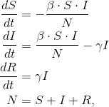
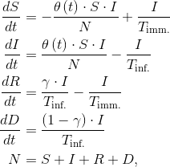

MDAO-Based Pandemic Countermeasure Optimization
========================================================

A Python-based set of tools for pandemic modeling with analytic derivatives, which allows for the numerical optimization of infectious disease mitigation techniques (social distancing, etc.). The aim is to provide a set of tools to help inform or derive localized policy decisions relating to the spread of illnesses such as COVID-19. This will include prognostics of infection magnitude and health care service capacity planning.

Background
===========

In what is known as the SIR model, a simplified expression of the dynamics of an infectious disease is given by the system of differential equations

where `S`, `I`, and `R` represent the number of susceptible, infected, and recovered individuals within the population that a given disease may spread, and `N` denotes the total size of this population. The constants `beta` and `gamma` are respectively known as the contact rate and recovery rate, and control the dynamics of the spread of the disease. 

Adaptation of SIR model for optimal control
===============================

In order to represent this system in a form that can be analyzed in a system optimization context applicable to general infectious diseases, let us consider a dynamic optimization control `theta(t)` to temporally reduce the natural contact rate of the disease `beta`, representing the application of social policies (such as Social Distancing measures).

Let us also more carefully consider the resolution of an infected individual, as one of two possibilities: recovery with immunity (i.e. assumption of a "recovered" state), or death `D`, an additional category of the model to be tracked and integrated. Let `gamma / T_inf.` be the recovery rate of the disease, divided by the average duration of the infection, which complimentary defines the mortality as `(1 - gamma) / T_inf.`. 

Similarly, let `T_imm` be the average duration of immunity to the disease granted by successful recovery. Then the rate of loss of immunity (and gain in susceptibility) can be established as `1 / T_imm`.

This will allow for consideration of mortality rates, and the possibilities relating to endemic cycling.

Implementation
================

The above equations were implemented in the dynamic systems optimization framework Dymos, which is built using the OpenMDAO optimization framework.

Minimize: 

Next steps 
===========
- Derivation of critical patient category, including hospitalized ICU versus unhospitalized categories
- Finer detailed calculation of the `sigma(t)` control parameter relating to social policy
- Calibration with real-world date related to the spread of COVID-19